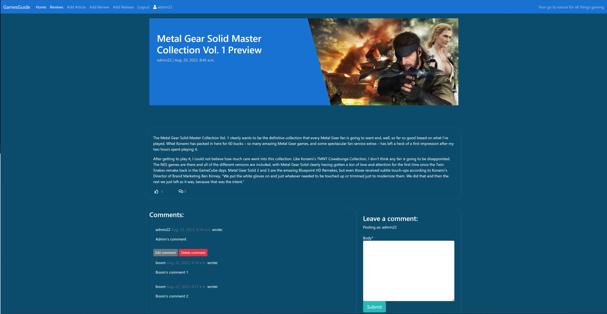

# GamesGuide

GamesGuide is a gaming website which contains the latest gaming news across all platforms (PC, Playstation, Xbox and Nintendo). It contains articles ranging from developer interviews to game previews of titles that are set to be released. These articles are meant to be informative to gamers who may wish to gain further information on specific titles that they are interested in purchasing.

I have also included a releases section/tab on the right-hand side of the homepage image which lists the games released in the current month. This quickly lets the user know all of the different titles that are about to come out so they are made aware and may decide to look into it if it piques their interest.

Furthermore, my site also contains a separate page dedicated purely to game reviews of the latest releases. The reason why I chose to include a different page strictly for reviews is to make it easier for users to view them if they want to get a good idea of the overall quality of a game to make an informed decision whether or not to make a purchase. This saves the user both time and effort sifting through article after article trying to find the review of a particular game they are interested in.


### [Live link](https://pp4-news-site-3458881b171b.herokuapp.com/)

## Table of Contents

- [GamesGuide](#gamesguide)
  * [Target Audience](#target-audience)
  * [User Experience (UX)](#user-experience-ux)
    + [User Stories](#user-stories)
    + [Design](#design)
      - [Colour Scheme](#colour-scheme)
      - [Imagery](#imagery)
      - [Fonts](#fonts)
  * [Agile Methodology](#agile-methodology)
  * [Data Model](#data-model)
  * [Security Features and Defensive Design](#security-features-and-defensive-design)
    + [User Authentication](#user-authentication)
    + [Form Validation](#form-validation)
    + [Database Security](#database-security)
  * [Features](#features)
    + [Header](#header)
    + [Home Page](#homepage)
    + [Hottest Releases of the month](#hottest-releases-of-the-month)
    + [Review Page](#reviews-page)
    + [User Account Pages](#user-account-pages)
    + [Edit comment/delete comment](#editing-and-deleting-comments) 
    + [Site admin functionality](#site-admin-functionality) 
    + [Add Article](#add-article)
    + [Add Release](#add-release)
    + [Add Review](#add-review)
    + [Crud functionality](#crud-functionality)
    + [Future Features](#future-features)
    + [Responsive Design](#responsive-design)
  * [Testing](#testing)  
  * [Deployment - Heroku](#deployment-heroku)
  * [Forking this repository](#forking-this-repository)
  * [Cloning this repository](#cloning-this-repository)
  * [Languages](#languages)
  * [Frameworks - Libraries - Programs Used](#frameworks---libraries---programs-used)
  * [Credits](#credits)
  * [Acknowledgments](#acknowledgments)


## Target Audience

The main target audience of my website is going to be gamers who either game on a PC or a console looking to gain some information relating to a specific title or just simply want to get the latest news in the world of gaming.

## User experience (UX)

The user experience in the way they interact with my site must be as pleasant and easy as possible. When a user enters my site and interacts with it, their level of engagement is determined by how they view the site and what their experience is like as they browse through. 

This is why the front end side of an application is just as important as the back end. I made sure that I did not just focus on the back end to the detriment of the front end side and spent a lot of time carefully constructing the style, structure and presentation of the website. I am very pleased with the result, as I believe it looks like a professionally made site that is easy and enjoyable to browse through.

Below are some key things I had to consider when focusing on the front end of my application:

- Visually attractive to users
- Easy and clear to read and view information
- Consistent styling when it comes to the colours and fonts used
- Consistent layout and structure of the site throughout all the different pages
- Very easy for users to navigate around with clearly defined links
- All of the links working correctly and as intended
- The information provided is both relevant and useful to the intended target audience

### User Stories

All of the User Stories that I have created can be seen on my [project board](https://github.com/users/Shaf8808/projects/4) in the Done section. There are a total of 25 different user stories all with varying degrees of importance. I divided these user stories into three different sections, the must have's, could have's and should have's. Based on these labels, I was able to prioritise my workload and place a greater emphasis on features that I had to include within my project.


#### User stories not yet implemented

Furthermore, I included some features which I could not implement due to time constraints. These can be found in the future features column on my project board.


### Design

I spent a lot of time and effort ensuring the design of my website was both visually appealing as well as simple and effective to users. I believe the final product has successfully achieved that goal both in the colour scheme used throughout the site as well as the structure I have decided to implement to display to the user. 

The main goal of my website is to inform the user through the use of relevant gaming articles which they could quickly select and open as they scroll through the page they are currently on. This is why I have decided to display three articles at a time on one row using Bootstrap which just contains the article title and the excerpt as a brief description.

I have made sure each article card on the homepage is designed in a way that is both aesthetically pleasing to look at as well as objective for achieving its goal. The user can simply look at a specific article 'card' and quickly deduce what it is about before clicking on the title to open it to display it's contents.

It was also important that the images used both as the main homepage image as well as those for each article were responsive and displayed to the user in a clear and structured way. This is why I decided to include the bootstrap class {img-fluid} which ensured that the height and width of the image did not compromise the structural integrity of the site on smaller screens.

[Back to top](#table-of-contents)

#### Colour Scheme
Colour palette from Coolors


As the image above shows, I have used a nice contrast of varying colours throughout my site. I have made sure that the colours used are not just visually attractive to look at, but also professional. The first colour I used for my nav bar, as I needed it to stand out from the rest of the page I decided to use a more bright colour. The second colour I used as the main background for my website. I decided to go for a darker indigo dye colour as I didn't want to put too much strain on the user's eyes as they are reading an article or review. 

The third grey colour was used for the releases column on the right of the homepage image, while the white colour was used for the text on my site so that users could see the words on my choice of background.


#### Imagery

I have only used one static image for my website, which is the main image on the homepage underneath the header "Welcome to Gamesguide". Every other image has been uploaded through Cloudinary.

[Back to top](#table-of-contents)

#### Fonts

The fonts that I used are Roboto and Lato, as can be seen in the links within my base.html file. I also used the font Exo for my review page header, which can be seen in my static CSS file at the top.

## Agile Methodology

I have utilised GitHub projects throughout the development process using an agile approach. What this means is that 25 User Stories were created in the To-Do column and as I began working on implementing each feature detailed in the issue, I moved them across to the In Progress and then eventually to the Completed column once finished. This was an effective way of keeping track of every feature I was working on during the development process as well as planning on the features I wanted to add to my project before starting. It also helped me in structuring my project and making sure I completed each user story feature before moving on to the next.

I have included appropriate labels such as 'could-have', 'should-have' and 'must-have' on features depending on their level of importance. This gave me a good idea of which features to work and concentrate on first (the 'must-haves') and which features to implement later on if I had time.

I have also added a column named 'Future features' that includes things which I could include later on should I wish to return to this project. This included issues such as a preview page which would be solely dedicated to game previews.      


Click on this link to view the project board [here](https://github.com/Shaf8808/)


## Data Model

I used principles of Object-Oriented Programming throughout this project and Django’s Class-Based Generic Views. Django AllAuth was used for the user authentication system.

When creating the data models for my project, I first had to plan what type of data I wanted to display to users on my site. In other words, what information did I want to include in my project that would be both relevant and helpful for my target audience which were gamers? 

This is how I came up with my current data model. The four main data models of my project are:

* Article
* Release
* Review
* Comment

Both the Article and Review models are very similar to one another with just a few exceptions such as score, as a review could technically be just another article. The release model I created was a custom data model that included less data as it was going to be displayed as a list next to the main image on the homepage, and therefore could not include a lot of data. The comment model was also completely custom as users had to be able to leave comments on both articles as well as reviews, so there was a little bit of an overlap. This meant that my comment model had two foreign keys for both articles and reviews. 

The diagram below details the database schema.


[Back to top](#table-of-contents)

## Security Features and Defensive Design

### User Authentication

I have utilised Django's preinstalled LoginRequiredMixin within some of my views to make sure that any requests to access secure pages by non-authenticated users are denied and redirected to the login page. 

I have also made use of Django's UserPassesTestMixin to limit access based on certain permissions. For example,  users can only edit/delete comments for which they are the author and not anyone else's. I have also made sure that only the site admin(myself) can add, edit and delete articles, releases and reviews. I have done this by using .

### Form Validation

If the user enters any incorrect type of data (such as text in a date field) or enters nothing at all, the form will not be posted and a warning will appear on the page informing the user of the issue.

[Back to top](#table-of-contents)

### Database Security

I have stored the database URL as well as my secret key within a hidden env.py file, which is included in my gitignore so any changes made to it will not be pushed to Git Hub and be made public. I have also used Cross-Site Request Forgery (CSRF) tokens on every form implemented throughout the site.

## Features

### Header

**Logo**
- I have decided to keep my logo nice and simple with the pre-installed Bootstrap class of nav-bar brand as I believe it looks neat, tidy and professional. I have decided to capitalize both G's in GamesGuide as I believe it looks aesthetically better and gives a more unique feel to the logo. 

**Navigation Bar**
- My navigation bar is displayed at the top of every page with styling that is consistent throughout the site
- It contains all of the various links that redirect the user to each page of the site

There are three main types of users for my particular site, which are:

- A user who is not authenticated and doesn't have an account


- A user who IS authenticated and has a registered account on the site


- A superuser (myself) who is the administrator (and builder) of the site with special privileges


Depending on which category the user falls under, my navigation bar displays different links, as can be seen in the screenshots above. When a user has logged in with an authenticated account, their username is displayed on the nav bar alongside a profile icon.

If a non-user logs in to the site, they will be presented with the option to either register an account of their own or to log in if they have already registered. If the user has already logged in to their account, they will be shown the option to log out of their account. If it is an admin who has logged in, they will be presented with more options about the special privileges only held by myself.

[Back to top](#table-of-contents)

### Homepage


The screenshot above showcases my main homepage which the user is greeted with as soon as they enter my site. I have spent a lot of time ensuring the overall structure and layout of the homepage were both visually attractive as well as laid out in an organised manner. 


As the only one who can add, edit and delete articles and releases on my website is the administrator (myself), the homepage that I look at is very different from the one other users see. The screenshot above shows what I can see when I log in with my admin credentials. As it shows, there are two buttons displayed at the bottom of each data entry for both articles as well as releases. One button is to edit a particular entry, while the other button deletes it from the site and database.

The reason why I decided to include this is because I needed a way for myself to quickly edit and/or delete data straight from the site itself rather than through the pre-installed admin panel included with the Django framework. It also covers the crud functionality of my website from an administrative perspective, with the ability to create, read, update and delete data. This is an effective and easy way of manipulating the data presented on the website to users.

[Back to top](#table-of-contents)

## Hottest Releases of the month

I have decided to include a column on the right-hand side of the page purely dedicated to all of the games being released in the current month. The reason why I have decided to include this is so that the user can quickly take one glance at the card and know immediately which titles are set for release, the release date and the platforms they are coming out on. This provides all of the necessary information in one tabular format while also maintaining a good structure and layout on the page. This can be seen in the image below:


[Back to top](#table-of-contents)

### Article/review detail page



The screenshot above shows my article detail page that users will see once they click on a particular article. I took a lot of inspiration from the Django Codestar blog walkthrough project that I followed along on the Code Institute LMS. The top half of the page uses the same masthead class styling as the Codestar blog, with the title displayed on the left, and the article image displayed on the right-hand side. The reason why I decided to use the same format is because I believed it was both suitable for my particular project as well as aesthetically appealing and professional to users. 

Below that is the content/body section which contains the actual article story. I have decided to include line breaks within my code so that it would automatically start a new paragraph whenever I enter spacing in the form. This is so that the structure and layout of my content are organised and won't just display as one big paragraph.

I have also included the added functionality of liking an article only if it is a registered user on the site. This can be done by clicking on the thumbs-up icon used by Font Awesome. Once it is clicked, the number displayed next to the icon will go up by one. If it is clicked again by the user, the number will decrease and revert to the original number. This feature of liking/unliking an article was once again borrowed from the Codestar blog tutorial, as I believe it is a feature that could be used for my site as well. I have also included a comment icon on the right that shows the number of comments in an article posted and approved by other users. 

Last, but not least, there is the comments section of the page. This is where users can view comments that have been posted and approved by the administrator. This is displayed on the left-hand side. On the right, registered users can write a comment of their own before clicking the submit button. This will not, however, automatically be posted to the site. They will be shown a message that says their comment is awaiting approval, which only I can provide. The reason why I have decided to implement this feature is so that the comments can be moderated and checked whether or not they are appropriate before being posted on the site for everyone to see.  

[Back to top](#table-of-contents)


The review details page is identical to the article detail page, as they are both quite similar in content with minor differences.

### Reviews page


The second page that I have created for my site is a reviews page. This is a page dedicated purely to game reviews of the latest titles. The reason why I decided to include this is to make it easier for users to quickly browse through all of the game reviews without needing to go through numerous different articles. This organises every review of a title onto one page for quick and easy access.


The gif above shows the custom CSS animation styling that I implemented on my review page header. I believe that this is both appropriate as well as visually eye-catching to users who enter the page. For the CSS text styling, I used the site [codepen](https://codepen.io/mireille1306/pen/BawdXzY) while making a few adjustments here and there to make it more appropriate for my site. 

For the custom animation, I used [slider-revolution](https://www.sliderrevolution.com/resources/css-text-animation/) to give the page more interactivity and catch the user's eye The name of the animation I used is css text revealing animation. I carefully looked at all the other animations on the site and decided this was the most appropriate and suitable for my project. 

[Back to top](#table-of-contents)

### User account pages

**Register page**


**Log in**


**Log out**


Django allauth was installed and used to create the register, log out and login functionality for my website. I have changed the login templates of Django Allauth (login, signup HTML files etc.) to improve UI and inherit the styling of my templates and CSS.

[Back to top](#table-of-contents)

## Editing and deleting comments


To provide users with the ability to add, view, edit and delete their data, I have added the functionality to edit and delete their comments should they wish to. I have made sure that my code only allows a user to change their comments, and not anybody else's, as can be seen in the gif above. 

The user that has logged into the site is called Boom for example. This can be seen at the top of the nav bar next to the profile icon. This user has left two comments on the article, both of which have buttons for editing comments and deleting comments.  The first comment left by the admin does not include the buttons, as it is a different user logged in to the site.

[Back to top](#table-of-contents)

## Site admin functionality

As a site administrator, I can add articles, releases as well and reviews on the website. This can be done through links at the top of the page on the nav bar that only the superuser can see and have access to. This can be seen in the image below:


Once a link has been selected, I am directed to the relevant form depending on the option I selected. The screenshots below show each form page for all three types of data that are present on my site.

### Add Article


### Add Release


### Add Review


[Back to top](#table-of-contents)

## Crud functionality

Being able to simply add articles and the like to view them on the site is of course not enough, as that only covers the first two parts of crud functionality. I needed the ability to both edit as well as delete data. The forms that I am shown once one of the two aforementioned buttons are selected can be seen below:

**Edit article**


**Delete article**


## Future features

I decided to include an additional column on my Kanban board aptly named Future Features. These are some things which I could include in the future if I ever revisit this particular project. Features which I could not implement due to time constraints. These include:

- Game previews
As a site user, I can navigate to a separate page to view game previews so that I can quickly and easily gain insight into upcoming games

- Draft articles and reviews
As a site admin, I can view all draft articles and reviews on the site so that I can quickly edit and publish them without needing to access the admin panel

[Back to top](#table-of-contents)

## Responsive design

My site needed to remain responsive on all devices, whether it was a laptop, PC, tablet or mobile phone. This is where Bootstrap helped ensure that all of my images could be viewed clearly without causing any issues when it came to positioning. This is why I used the bootstrap class of img-fluid to ensure that the height and width of my images matched the screen size of the device the user was viewing my site.

All of my article 'cards' are displayed in rows of three on bigger screen sizes, but then fill the full width of the screen on mobile devices and are displayed one after another. This can be seen in the gif below:


I believe that this makes it easy for users using their phones to scroll through my website and easily view all the different articles without everything becoming too cramped and unreadable. The gif below shows my review page which is also fully responsive on smaller screens:


I had to be particularly careful when it came to my review header due to the font style as well as making sure the animation functioned correctly and did not negatively impact the structure of the page. I am very pleased with how the final result turned out, as the animation works well on smaller screens and adds a touch of creativity to the page. 

The article/review detail page also of course needed to be responsive in a way that all of the main content and information provided on the page could be clearly and easily read by the user. The gif below shows how it looks on a smaller screen:


I have decided to get rid of the image on the detail page altogether as it would look awkward and strange if included on a smaller screen. I am pleased with how it looks in its current form.  

The navbar for my site is also fully responsive thanks to the prerequisite bootstrap navbar classes that I utilised for my project. As the screen gets smaller, it transforms from a regular navbar to a 'hamburger-style navbar. The gif below showcases how it works on smaller devices:


Thanks to the navbar-expand/collapse classes, once the user clicks the hamburger icon, all of the links drop down for selection. If clicked again, the navbar closes back to its original form. I believe that this is an effective way of ensuring it is easy for mobile users to quickly and easily navigate to a page if required, as well as view all of the different links available to them on a smaller screen.


[Back to top](#table-of-contents)


## Testing

My testing section can be found [here](./TESTING.md)

[Back to top](#table-of-contents)

## Deployment-Heroku

The information below was taken from the LMS of Code Institute.
To successfully deploy this site to Heroku, the following steps were taken:

### Creating the Heroku app
- Log in to Heroku
- Click the 'New' button on the main page in the top right corner before selecting 'Create New App' from the drop-down menu
- Enter a unique app name
- Select your specific region
- Click on the Create App button

### Create relevant files/directories
- Create a requirements.txt file
- Create three directories in the main directory; media, storage and templates
- Create a file named "Procfile" in the main directory and add the following: 
```
web: gunicorn project-name.wsgi
```

### Update Heroku Config Vars
Add the following Config Vars in Heroku:

- SECRET_KEY value
- CLOUDINARY_URL
- PORT = 8000
- DISABLE_COLLECTSTATIC = 1

### Creating the Postgres database:
- Log in to ElephantSQL or create an account
- Click 'Create New Instance'
- Set up your plan by giving it a name
- Select the Tiny Turtle (Free) plan. You can leave the Tags field blank
- Click 'Select Region'
- Select a data centre near you
- Then click 'Review'
- Check your details are correct and then click 'Create Instance'
- Return to the ElephantSQL dashboard and click on the database instance name for this project
- Copy the database URL for your project

### Connecting the database to our app

- Navigate to your specific app
- Go to the Settings tab
- Click Reveal Config Vars
- Add a Config Var called DATABASE_URL. Paste your ElephantSQL database URL in as the value

### Connecting the external database to your IDE
- In your env.py file add a new key, DATABASE_URL, and give it a value of the copied database URL
```
os.environ.setdefault("DATABASE_URL", "my_copied_database_url")
```
- Install the dj-database-url package version 0.5.0 in the terminal with pip3. This will allow us to parse the URL we got above to a format Django can work with:
```
pip3 install dj_database_url==0.5.0
```
- Add it to your requirements.txt with
```
pip3 freeze --local > requirements.txt
```
- At the top of settings.py, import the package and the env.py file
```
from pathlib import Path
 import os
 import dj_database_url
 if os.path.isfile('env.py'):
     import env
```
- In settings.py, comment out the default database setting and replace it to use the DATABASE_URL environment variable. Your code should now look like this:
```
# DATABASES = {
#     'default': {
#         'ENGINE': 'django.db.backends.sqlite3',
#         'NAME': BASE_DIR / 'db.sqlite3',
#     }
# }

DATABASES = {
    'default': dj_database_url.parse(os.environ.get("DATABASE_URL"))
}
```
- Run the migrate command in the terminal to build the database according to the model structure
```
python3 manage.py migrate
```
- Run the project to test that everything is connected properly

### Deploy

- Ensure in Django settings, DEBUG is False
- Go to the deploy tab on Heroku and connect to GitHub, then to the required repository.
- Scroll to the bottom of the deploy page and either click Enable Automatic Deploys for automatic deploys or Deploy Branch to deploy manually. Manually deployed branches will need re-deploying every time the repo is pushed and updated.
- Click View to view the deployed site.
The site is now live and operational.


[Back to top](#table-of-contents)


## Forking this repository

- Locate the repository [here](https://github.com/Shaf8808/PP4-news-site)
- On the top right-hand corner of the page, select 'Fork'

## Cloning this repository

- Locate the repository [here](https://github.com/Shaf8808/PP4-news-site)
- There are different cloning options available, such as HTTPS, SSH and Github CLI. You can view these under the button 'Code'. Choose your preferred option before copying the link provided 
- Open your terminal
- In  the terminal, change the current working directory to the desired location of the cloned directory
- Type 'git clone', and then paste the URL copied from GitHub earlier
- Type 'Enter' to create the local clone


[Back to top](#table-of-contents)

## Languages

- Python
- HTML
- CSS
- Javascript


## Frameworks - Libraries - Programs used

- [Django](https://www.djangoproject.com/): Main python framework used in the development of this project
- [Django-allauth](https://django-allauth.readthedocs.io/en/latest/): authentication library used to create the user accounts
- [ElephantSQL](https://www.elephantsql.com/) was used as the database for this project.
- [Heroku](https://dashboard.heroku.com/login) - was used as the cloud-based platform to deploy the site on.
- [Chrome Dev Tools](https://developer.chrome.com/docs/devtools/) - Used for overall development and tweaking, including testing responsiveness and performance.
- [Font Awesome](https://fontawesome.com/) - Used for icons in the information bar.
- [GitHub](https://github.com/) - Used for version control and agile tool.
- [Google Fonts](https://fonts.google.com/) - Used to import and alter fonts on the page.
- [W3C](https://www.w3.org/) - Used for HTML & CSS Validation.
- [PEP8 Online](http://pep8online.com/) - used to validate all the Python code
- [Jshint](https://jshint.com/) - used to validate javascript
- [Coolors](https://coolors.co/) - Used to create a colour palette.
- [Google Sheets](https://docs.google.com/spreadsheets) - used to create the database schema design
- [Grammerly](https://app.grammarly.com/) - used to proofread the README.md
- [Summernote](https://summernote.org/): A WYSIWYG editor to allow users to edit their posts
- [Crispy Forms](https://django-crispy-forms.readthedocs.io/en/latest/) used to manage Django Forms
- [Cloudinary](https://cloudinary.com/): the image hosting service used to upload images
- [Cloudconvert](https://cloudconvert.com/mp4-to-gif): used to convert mp4 clips to gifs
- [Bootstrap 5.0.1](https://getbootstrap.com/docs/5.0/getting-started/introduction/): CSS Framework for developing responsiveness and styling


[Back to top](#table-of-contents)

## Credits

Code Institute Django Codestar blog

Summernote - wysiwyg text editor

Review header text styling:
https://codepen.io/mireille1306/pen/BawdXzY

Review header text animation
https://www.sliderrevolution.com/resources/css-text-animation/ 
(CSS TEXT REVEALING ANIMATION)

Articles:

Metal Gear article:
https://www.ign.com/articles/metal-gear-solid-master-collection-vol-1-preview-first-impressions

Assassins Creed Mirage:
https://www.ign.com/articles/assassins-creed-mirage-release-date-gameplay-story-trailers-latest-news

Call of Duty MW3:
https://www.ign.com/articles/call-of-duty-modern-warfare-iii-reverses-course-on-mwii

Mortal Kombat article:
https://www.ign.com/articles/mortal-kombat-1-pre-order-beta-johnny-cage-ps5-xbox

Reviews:

Baldur's Gate 3:
https://www.ign.com/articles/baldurs-gate-3-review

Texas Chainsaw Massacre:
https://www.ign.com/articles/the-texas-chain-saw-massacre-review

Shadow Gambit: The Cursed Crew:
https://www.ign.com/articles/shadow-gambit-the-cursed-crew-review

Blasphemous 2:
https://www.ign.com/articles/blasphemous-2-review

Images:

Homepage image:
https://images.app.goo.gl/PLRHFzjFUYj3718H9

Modern Warfare 3:
https://images.app.goo.gl/G5MjrxXBBxkVG1xw5

Metal Gear Solid:
https://images.app.goo.gl/NbxNfM9vnuZmoHaBA

Assassins Creed Mirage:
https://images.app.goo.gl/CDurnHuWeoMJXtaW9

Mortal Kombat:
https://images.app.goo.gl/DK3G7bYTgf54nkyY8

Texas Chainsaw Massacre:
https://images.app.goo.gl/vrbBbdUFDb5qFqJU6

Shadow Gambit the Cursed Crew:
https://images.app.goo.gl/6BiRYQNq6CMCq7jm7

Baldur's Gate:
https://images.app.goo.gl/FdrURmXKXsmdiXHC8


Stack Overflow

As an example and for inspiration:

[IGN](https://www.ign.com/uk)

[Gamespot](https://www.gamespot.com/)

AliOKeeffe - PP4_My_Meal_Planner


## Acknowledgments

Many thanks to my tutor Rebecca and my mentor Antonio for their help and answering my niggling questions. Also a big thank you to the incredibly helpful tutors over at Code Institute for solving a few issues that I encountered along the way while building this gigantic project.


[Back to top](#table-of-contents)


REMEMBER TO PROVIDE ADMIN CREDENTIALS BEFORE SUBMITTING!!!!!!!!!!!!!!!!!!!!!!!!!!!!!!!!!!!!!!!!!!!!!!!!!