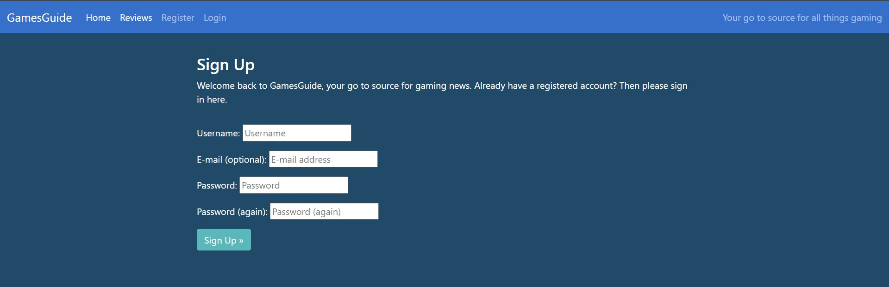

Click [here](./README.md) to be redirected back to the original Readme document

# Table of Contents
- [User Story Testing](#user-story-testing)
- [Validator Testing](#validator-testing)
  * [HTML](#html)
  * [CSS](#css)
  * [Javascript](#javascript)
  * [Python](#python)
- [Browser Testing](#browser-testing)
- [Device Testing](#device-testing)
- [Manual Testing](#manual-testing)
  * [Site Navigation](#site-navigation)
  * [Add Article](#add-article-page)
  * [Add Review](#add-review-page)
  * [Add Release](#add-release-page)
  * [Editing articles](#editing-articles)
  * [Deleting articles](#deleting-articles)
  * [Editing reviews](#editing-reviews)
  * [Deleting reviews](#deleting-reviews)
  * [Editing releases](#editing-releases)
  * [Deleting releases](#deleting-releases)
  * [User interactivity](#deleting-releases)
  * [Deleting releases](#deleting-releases)
  * [Deleting releases](#deleting-releases)
  * [Deleting releases](#deleting-releases)
  * [Deleting releases](#deleting-releases)
- [Bugs](#bugs)
  * [Fixed Bugs](#fixed-bugs)
    + 
    + 
    + 
    + 
    + 
  * [Unfixed bugs:](#unfixed-bugs-)

## User story testing

#### User story: Account registration

*As a site user I can register to the gaming news site so that I can login and comment on stories and reviews as well as like them*

The option to register and login is always visible to the user as it is viewable on the navigation bar displayed at the top of every page

If they click the register link at the top, the sign up page taken from the django framework is displayed which can be seen below: 

Once they have successfully registered and logged in to their account, a success message is displayed for a few seconds as well as the name of their profile alongside an icon to clearly show whether or not a user has successfully logged in and who the user is

#### User story: Approve comments

*As a site admin I can approve or disapprove comments so that I can control and filter out any inappropriate comments made by other users on the site*

When it comes to comes to leaving comments, I have decided to implement the same feature used in the Codestar blog tutorial of comment approval. The reason as to why I have done this is so that I as the administrator have a greater cotrol over the types of comments that are posted on the site in case some are inappropriate or offensive.

As the gif shows below, this works as intended:

#### User story: Like/Unlike

*As a site user I can like or unlike a story so that I can easily convey whether I like the article or not with the click of a button*

I have also added the feature of liking and unlike articles and reviews, which can be done at the mere click of a button in the shape of a thumbs up icon. Once a user has clicked the button, the number next to it goes up by one. If clicked again the number goes down by one and reverts back to the original amount. This is shown in the clip below:

Depending on the number of likes that an article or a review has, the amount is displayed on each 'card' on the homepage (or review page, depending on what it is). This can be seen in the image below.

#### User story: Managing articles

*As a site admin I can create, read, update and delete articles so that I can manage and control my content*

In terms of the content of my website, it is split into three main categories. Articles, Reviews and Releases. It was of course important that I was able to add this content successfully without throwing any errors, as well as cover the rest of crud functionality successfully. 

[Back to top](#table-of-contents)

## Validator Testing

### HTML

Every html page was validated using [W3C HTML Validator](https://validator.w3.org/)

### Css

No errors were found when passing my CSS file through the official [W3C CSS Validator](https://jigsaw.w3.org/css-validator/)

### Javascript

No errors were found when passing my javascript through [Jshint](https://jshint.com/)

### Python

No errors were found when passing my Python files through [Pep8](https://pep8ci.herokuapp.com/)

[Back to top](#table-of-contents)

## Browser Testing

The website was tested on different browsers such as Google Chrome, Safari and Firefox with no issues apparent

## Device Testing

My site was meticulously tested and viewed multiple times on desktop, laptop and mobile phones in order to see if the structure and layout of the site remained uncompromised. It holds up well regardless of the device it is being viewed on. I also utilised Chrome developer tools to check this, with positive results.

## Manual Testing

### Site navigation

| Element               | Action     | Expected Result                                                    | Pass/Fail |
|-----------------------|------------|--------------------------------------------------------------------|-----------|
| NavBar                |            |                                                                    |           |
| Site Name (logo)      | Click      | Redirect to home page                                              | Pass      |
| Home Link             | Click      | Redirect to home page                                              | Pass      |
| Reviews Link          | Click      | Redirect to Reviews page                                           | Pass      |
| Register Link         | Click      | Redirect to Register page                                          | Pass      |
| Login Link            | Click      | Redirect to Login page                                             | Pass      |
| User profile name     | Display    | Displays name of authenticated user once logged in                 | Pass      |
| Logout link           | Display    | Only visible if user is logged in                                  | Pass      |
| Logout link           | Click      | Redirects to logout page                                           | Pass      |
| Add article link      | Display    | Only visible for myself the administrator                          | Pass      |
| Add article link      | Click      | Redirects to add article form                                      | Pass      |
| Add review link       | Click      | Redirects to add review form                                       | Pass      |
| Add review link       | Display    | Only visible for myself the administrator                          | Pass      |
| Add release link      | Display    | Only visible for myself the administrator                          | Pass      |
| Add release link      | Click      | Redirects to add release form                                      | Pass      |
| Article detail link   | Click      | Opens the article to the article detail page                       | Pass      |
| Review detail link    | Click      | Opens the review to the review detail page                         | Pass      |
| Register Link         | Display    | Not visible if user in session                                     | Pass      |
| Log In Link           | Display    | Not visible if user in session                                     | Pass      |
| All Nav Links         | Hover      | Brightens text                                                     | Pass      |
|                       |            |                                                                    |           |
| Mobile View           |            |                                                                    |           |
| Hamburger Menu        | Responsive | Displays when screen size is reduced to medium                     | Pass      |
| Dropdown menu         | Responsive | Menu with nav links transform to dropdown when screen size reduces to medium       | Pass      |
| Home Link             | Click      | Redirect to home page                                              | Pass      |
| Reviews Link          | Click      | Redirect to Reviews page                                           | Pass      |
| Register Link         | Click      | Redirect to Register page                                          | Pass      |
| Login Link            | Click      | Redirect to Login page                                             | Pass      |
| User profile name     | Display    | Displays name of authenticated user once logged in                 | Pass      |
| Logout link           | Display    | Only visible if user is logged in                                  | Pass      |
| Logout link           | Click      | Redirects to logout page                                           | Pass      |
| Add article link      | Display    | Only visible for myself the administrator                          | Pass      |
| Add article link      | Click      | Redirects to add article form                                      | Pass      |
| Add review link       | Click      | Redirects to add review form                                       | Pass      |
| Add review link       | Display    | Only visible for myself the administrator                          | Pass      |
| Add release link      | Display    | Only visible for myself the administrator                          | Pass      |
| Add release link      | Click      | Redirects to add release form                                      | Pass      |
| Article detail link   | Click      | Opens the article to the article detail page                       | Pass      |
| Review detail link    | Click      | Opens the review to the review detail page                         | Pass      |
| Register Link         | Display    | Not visible if user in session                                     | Pass      |
| Log In Link           | Display    | Not visible if user in session                                     | Pass      |
| All Nav Links         | Hover      | Brightens text                                                     | Pass      |
|                       |            |                                                                    |           |

### Add Article page

| Element               | Action     | Expected Result                                                    | Pass/Fail |
|-----------------------|------------|--------------------------------------------------------------------|-----------|
| NavBar                | Display    | Shows navbar on form page                                          | Pass      |
| Title field           | Display    | Displays title field                                              | Pass      |
| Slug field            | Display      | Displays slug field                                              | Pass      |
| Image field          | Display      | Displays image field                                           | Pass      |
| Content field         | Display      | Displays content field                                          | Pass      |
| Excerpt field            | Display      | Displays excerpt field                                            | Pass      |
| Status field    | Display    | Displays status field with the relevant options                  | Pass      |
| Submit button    | Click    | Creates new article 'card' and displays it on homescreen                 | Pass      |
| Submit button    | Click    | Informs user of any empty fields if there are any before submitting                | Pass      |
| Cancel button    | Click    | Redirects to homepage                 | Pass      |

### Add Review page

| Element               | Action     | Expected Result                                                    | Pass/Fail |
|-----------------------|------------|--------------------------------------------------------------------|-----------|
| NavBar                | Display    | Shows navbar on form page                                          | Pass      |
| Title field           | Display    | Displays title field                                              | Pass      |
| Slug field            | Display      | Displays slug field                                              | Pass      |
| Review date field            | Display      | Displays field                                              | Pass      |
| Score field            | Display      | Displays field                                              | Pass      |
| Image field          | Display      | Displays image field                                           | Pass      |
| Content field         | Display      | Displays content field                                          | Pass      |
| Excerpt field            | Display      | Displays excerpt field                                            | Pass      |
| Status field    | Display    | Displays status field with the relevant options                  | Pass      |
| Submit button    | Click    | Creates new review 'card' and displays it on review page                 | Pass      |
| Submit button    | Click    | Informs user of any empty fields if there are any before submitting                | Pass      |
| Cancel button    | Click    | Redirects to review page                 | Pass      |

[Back to top](#table-of-contents)

### Add Release page

| Element               | Action     | Expected Result                                                    | Pass/Fail |
|-----------------------|------------|--------------------------------------------------------------------|-----------|
| NavBar                | Display    | Shows navbar on form page                                          | Pass      |
| Name field           | Display    | Displays field                                              | Pass      |
| Slug field            | Display      | Displays field                                              | Pass      |
| Release date field            | Display      | Displays field                                              | Pass      |
| Platform field            | Display      | Displays field                                              | Pass      |
| Badges             | Display      | Adds appropriately styled badge depending on the release platform                                              | Pass      |
| Submit button    | Click    | Creates new release item and displays it on homepage releases section                 | Pass      |
| Submit button    | Click    | Informs user of any empty fields if there are any before submitting                | Pass      |
| Cancel button    | Click    | Redirects to homepage                 | Pass      |

### Editing articles

| Element               | Action     | Expected Result                                                    | Pass/Fail |
|-----------------------|------------|--------------------------------------------------------------------|-----------|
| NavBar                | Display    | Shows navbar on form page                                          | Pass      |
| Fields            | Display    | Displays all fields filled with the correct data                       | Pass      |
| Submit button    | Click/Display    | Updates correct article with new data and displays it on homepage                 | Pass      |
| Submit button    | Click/Display    | Informs user of any empty fields if there are any before submitting                | Pass      |
| Cancel button    | Click/Display    | Redirects to homepage                 | Pass      |

### Deleting articles

| Element               | Action     | Expected Result                                                    | Pass/Fail |
|-----------------------|------------|--------------------------------------------------------------------|-----------|
| NavBar                | Display    | Shows navbar on page                                          | Pass      |
| Message            | Display    | Displays an appropriate delete message                       | Pass      |
| Delete button    | Click/Display    | Deletes correct article and removes it from the homepage                 | Pass      |
| Cancel button    | Click/Display    | Redirects to homepage                 | Pass      |

### Editing reviews

| Element               | Action     | Expected Result                                                    | Pass/Fail |
|-----------------------|------------|--------------------------------------------------------------------|-----------|
| NavBar                | Display    | Shows navbar on form page                                          | Pass      |
| Fields            | Display    | Displays all fields filled with the correct data                       | Pass      |
| Submit button    | Click/Display    | Updates correct review with new data and displays it on homepage                 | Pass      |
| Submit button    | Click/Display    | Informs user of any empty fields if there are any before submitting                | Pass      |
| Cancel button    | Click/Display    | Redirects to review page                 | Pass      |

### Deleting reviews

| Element               | Action     | Expected Result                                                    | Pass/Fail |
|-----------------------|------------|--------------------------------------------------------------------|-----------|
| NavBar                | Display    | Shows navbar on page                                          | Pass      |
| Message            | Display    | Displays an appropriate delete message                       | Pass      |
| Delete button    | Click/Display    | Deletes correct review and removes it from the review page                 | Pass      |
| Cancel button    | Click/Display    | Redirects to review page                 | Pass      |

[Back to top](#table-of-contents)

### Editing releases

| Element               | Action     | Expected Result                                                    | Pass/Fail |
|-----------------------|------------|--------------------------------------------------------------------|-----------|
| NavBar                | Display    | Shows navbar on form page                                          | Pass      |
| Fields            | Display    | Displays all fields filled with the correct data                       | Pass      |
| Submit button    | Click/Display    | Updates correct release with new data and displays it on homepage                 | Pass      |
| Submit button    | Click/Display    | Informs user of any empty fields if there are any before submitting                | Pass      |
| Cancel button    | Click/Display    | Redirects to homepage                 | Pass      |

### Deleting releases

| Element               | Action     | Expected Result                                                    | Pass/Fail |
|-----------------------|------------|--------------------------------------------------------------------|-----------|
| NavBar                | Display    | Shows navbar on page                                          | Pass      |
| Message            | Display    | Displays an appropriate delete message                       | Pass      |
| Delete button    | Click/Display    | Deletes correct release data and removes it from the homepage                 | Pass      |
| Cancel button    | Click/Display    | Redirects to homepage                 | Pass      |

### User interactivity

| Element               | Action     | Expected Result                                                    | Pass/Fail |
|-----------------------|------------|--------------------------------------------------------------------|-----------|
| Like and comment icon              | Display    | Shows number of likes and comments for each article/review                                          | Pass      |
| Like            | Display/Click    | Lets the user 'like' an article/review                       | Pass      |
| Comment form    | Display    | Displays the comment form on an article/review only for authenticated users                 | Pass      |
| Comment submit    | Click/Display    | Allows the user to comment on an article/review                 | Pass      |
| Comment approval message    | Display    | Informs user their comment is awaiting approval once posted                 | Pass      |

### User authentication

#### Register

| Element               | Action     | Expected Result                                                    | Pass/Fail |
|-----------------------|------------|--------------------------------------------------------------------|-----------|
| Register              | Display    | Shows all relevant fields to sign up and create an account                                          | Pass      |
| Sign Up button            | Display/Click    | Displays the sign up button and informs user of any empty fields                      | Pass      |
| Create account   | Display/Click    | Successfully creates a user account and displays an appropriate message                | Pass      |

#### Login

| Element               | Action     | Expected Result                                                    | Pass/Fail |
|-----------------------|------------|--------------------------------------------------------------------|-----------|
| Login              | Display    | Shows all relevant fields to sign into an existing account                                         | Pass      |
| Login button            | Display/Click    | Displays the login button and informs user of any empty fields                      | Pass      |
| User account   | Display/Click    | Successfully logs in and displays an appropriate message                | Pass      |

#### Logout

| Element               | Action     | Expected Result                                                    | Pass/Fail |
|-----------------------|------------|--------------------------------------------------------------------|-----------|
| Logout              | Display    | Shows a relevant message asking if the user wants to log out                                         | Pass      |
| Logout button            | Display/Click    | Displays the logout button and successfully logs the user out of their account w/ a message                      | Pass      |

The above tables were created using [AliOKeeffe's](https://github.com/AliOKeeffe/PP4_My_Meal_Planner/blob/main/TESTING.md) readme as an example

[Back to top](#table-of-contents)

## Bugs

### Fixed Bugs

There were of course a number of bugs big and small that I came across while contstructing my site. These can be seen in the list below:

An error with data type being an integar unable to be converted to a datetimefield

Trying to write a custom class based view so that both the Release data as well as the Article data would be displayed correctly on the homepage was a big challenge for me when building this site. 

Adding crud functionality to my site was undoubtedly one of the most challenging aspects of building my project. As the  codestar blog tutorial only covered an administrator being able to edit user comments as well as delete them, I had to find a way to allow a specific registered user to be able to both edit as well as delete their own comment without altering anybody else's. 

Including null=True to my review and article fields in my Comment data model ensured that the fields could be null meaning I don't have to provide data for those fields when posting comments on either the articles page or reviews page.

I was having some issues with posting an image through my form I created in Django, as everything else was being posted successfully. I managed to, however, with some help from tutor support identify the problem which was the enctype="multipart/form-data" attribute. This is set to text by default, which I needed to change in order to successfully post an image.

## Unfixed Bugs

There are no unfixed bugs

[Back to top](#table-of-contents)